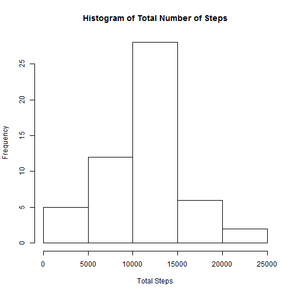
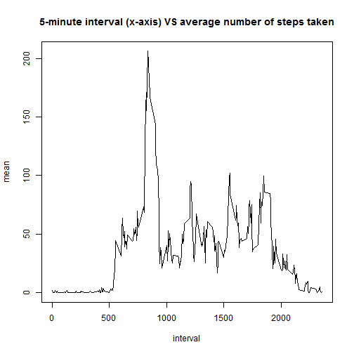
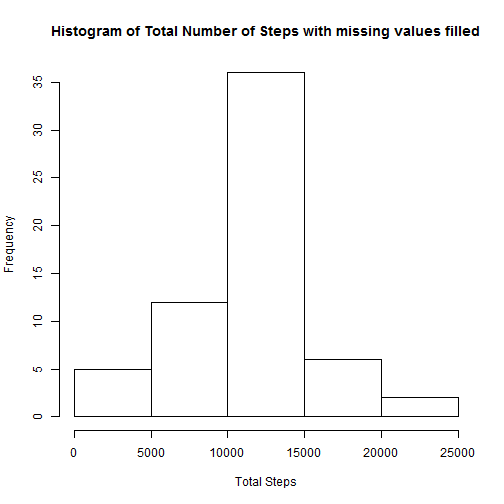
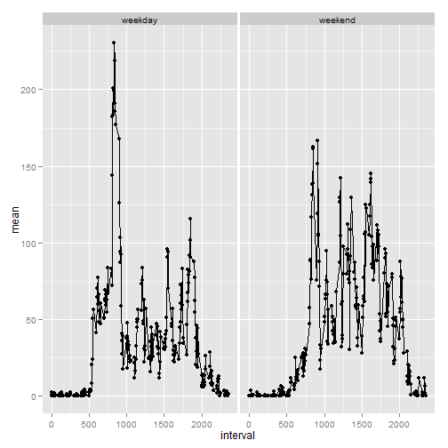

#Assignment 1 for Reproducible Research


Load the necessary libraries


```r
library(plyr)
library(ggplot2)
```

Read in the activity  monitor dataset and stored in data


```r
data<-read.csv("activity.csv")
```

Plot the histogram of the total number of steps taken per day (ignoring NA):


```r
int<-data[!is.na(data$steps),c(1,2,3)]
dd<-ddply(int,.(date),summarize,sum=sum(steps))
hist(dd[,2],main="Histogram of Total Number of Steps",xlab="Total Steps")
```

 

The mean and median steps taken per day are:  

```r
ddply(int,.(date),summarize,mean=mean(steps),median=median(steps))
```

```
##          date       mean median
## 1  2012-10-02  0.4375000      0
## 2  2012-10-03 39.4166667      0
## 3  2012-10-04 42.0694444      0
## 4  2012-10-05 46.1597222      0
## 5  2012-10-06 53.5416667      0
## 6  2012-10-07 38.2465278      0
## 7  2012-10-09 44.4826389      0
## 8  2012-10-10 34.3750000      0
## 9  2012-10-11 35.7777778      0
## 10 2012-10-12 60.3541667      0
## 11 2012-10-13 43.1458333      0
## 12 2012-10-14 52.4236111      0
## 13 2012-10-15 35.2048611      0
## 14 2012-10-16 52.3750000      0
## 15 2012-10-17 46.7083333      0
## 16 2012-10-18 34.9166667      0
## 17 2012-10-19 41.0729167      0
## 18 2012-10-20 36.0937500      0
## 19 2012-10-21 30.6284722      0
## 20 2012-10-22 46.7361111      0
## 21 2012-10-23 30.9652778      0
## 22 2012-10-24 29.0104167      0
## 23 2012-10-25  8.6527778      0
## 24 2012-10-26 23.5347222      0
## 25 2012-10-27 35.1354167      0
## 26 2012-10-28 39.7847222      0
## 27 2012-10-29 17.4236111      0
## 28 2012-10-30 34.0937500      0
## 29 2012-10-31 53.5208333      0
## 30 2012-11-02 36.8055556      0
## 31 2012-11-03 36.7048611      0
## 32 2012-11-05 36.2465278      0
## 33 2012-11-06 28.9375000      0
## 34 2012-11-07 44.7326389      0
## 35 2012-11-08 11.1770833      0
## 36 2012-11-11 43.7777778      0
## 37 2012-11-12 37.3784722      0
## 38 2012-11-13 25.4722222      0
## 39 2012-11-15  0.1423611      0
## 40 2012-11-16 18.8923611      0
## 41 2012-11-17 49.7881944      0
## 42 2012-11-18 52.4652778      0
## 43 2012-11-19 30.6979167      0
## 44 2012-11-20 15.5277778      0
## 45 2012-11-21 44.3993056      0
## 46 2012-11-22 70.9270833      0
## 47 2012-11-23 73.5902778      0
## 48 2012-11-24 50.2708333      0
## 49 2012-11-25 41.0902778      0
## 50 2012-11-26 38.7569444      0
## 51 2012-11-27 47.3819444      0
## 52 2012-11-28 35.3576389      0
## 53 2012-11-29 24.4687500      0
```
Plot the time series of 5-minute interval vs average number of steps taken:  

```r
dd2<-ddply(int,.(interval),summarize,mean=mean(steps))
plot(dd2,type="l",main="5-minute interval (x-axis) VS average number of steps taken")
```

 
The 5-minute interval that had the maximum number of steps:  

```r
dd2[which.max(dd2[,2]),1]
```

```
## [1] 835
```
Inputing missing values

There are lot of missing steps value that is presented as NA. Calculate the total number of missing values in the dataset (i.e. the total number of rows with NAs):

```r
sum(is.na(data$steps))
```

```
## [1] 2304
```
To replace the missing steps value by the same day mean vlibalue.  

```r
mydata<-data
ll<-dim(data)

for(i in 1:ll[1])
{
  
  if(is.na(mydata[i,1]))
  {
    y<-mydata[i,3]
    mydata[i,1]<-(dd2[dd2$interval==y,2])
   
  }

}
```
Histogram of the total number oF steps taken per day:  


```r
dd4<-ddply(mydata,.(date),summarize,sum=sum(steps))
hist(dd4[,2],main="Histogram of Total Number of Steps with missing values filled",xlab="Total Steps")
```

 
The mean and median steps taken per day are

```r
ddply(mydata,.(date),summarize,mean=mean(steps),median=median(steps))
```

```
##          date       mean   median
## 1  2012-10-01 37.3825996 34.11321
## 2  2012-10-02  0.4375000  0.00000
## 3  2012-10-03 39.4166667  0.00000
## 4  2012-10-04 42.0694444  0.00000
## 5  2012-10-05 46.1597222  0.00000
## 6  2012-10-06 53.5416667  0.00000
## 7  2012-10-07 38.2465278  0.00000
## 8  2012-10-08 37.3825996 34.11321
## 9  2012-10-09 44.4826389  0.00000
## 10 2012-10-10 34.3750000  0.00000
## 11 2012-10-11 35.7777778  0.00000
## 12 2012-10-12 60.3541667  0.00000
## 13 2012-10-13 43.1458333  0.00000
## 14 2012-10-14 52.4236111  0.00000
## 15 2012-10-15 35.2048611  0.00000
## 16 2012-10-16 52.3750000  0.00000
## 17 2012-10-17 46.7083333  0.00000
## 18 2012-10-18 34.9166667  0.00000
## 19 2012-10-19 41.0729167  0.00000
## 20 2012-10-20 36.0937500  0.00000
## 21 2012-10-21 30.6284722  0.00000
## 22 2012-10-22 46.7361111  0.00000
## 23 2012-10-23 30.9652778  0.00000
## 24 2012-10-24 29.0104167  0.00000
## 25 2012-10-25  8.6527778  0.00000
## 26 2012-10-26 23.5347222  0.00000
## 27 2012-10-27 35.1354167  0.00000
## 28 2012-10-28 39.7847222  0.00000
## 29 2012-10-29 17.4236111  0.00000
## 30 2012-10-30 34.0937500  0.00000
## 31 2012-10-31 53.5208333  0.00000
## 32 2012-11-01 37.3825996 34.11321
## 33 2012-11-02 36.8055556  0.00000
## 34 2012-11-03 36.7048611  0.00000
## 35 2012-11-04 37.3825996 34.11321
## 36 2012-11-05 36.2465278  0.00000
## 37 2012-11-06 28.9375000  0.00000
## 38 2012-11-07 44.7326389  0.00000
## 39 2012-11-08 11.1770833  0.00000
## 40 2012-11-09 37.3825996 34.11321
## 41 2012-11-10 37.3825996 34.11321
## 42 2012-11-11 43.7777778  0.00000
## 43 2012-11-12 37.3784722  0.00000
## 44 2012-11-13 25.4722222  0.00000
## 45 2012-11-14 37.3825996 34.11321
## 46 2012-11-15  0.1423611  0.00000
## 47 2012-11-16 18.8923611  0.00000
## 48 2012-11-17 49.7881944  0.00000
## 49 2012-11-18 52.4652778  0.00000
## 50 2012-11-19 30.6979167  0.00000
## 51 2012-11-20 15.5277778  0.00000
## 52 2012-11-21 44.3993056  0.00000
## 53 2012-11-22 70.9270833  0.00000
## 54 2012-11-23 73.5902778  0.00000
## 55 2012-11-24 50.2708333  0.00000
## 56 2012-11-25 41.0902778  0.00000
## 57 2012-11-26 38.7569444  0.00000
## 58 2012-11-27 47.3819444  0.00000
## 59 2012-11-28 35.3576389  0.00000
## 60 2012-11-29 24.4687500  0.00000
## 61 2012-11-30 37.3825996 34.11321
```
Convert date column to date format and add one more coloumn (week) to indicate whether is weekend or weekday


```r
mydata$date<-as.Date(mydata$date,"%Y-%m-%d")

mydata$week<-ifelse(weekdays(mydata$date)=="Sunday"| weekdays(mydata$date)=="Saturday" ,"weekend","weekday")
```
Compute the mean steps across interval for different day.

```r
pp<-ddply(mydata,.(interval,week),summarize,mean=mean(steps))
```
Plot panel time series of interval mean step for weekday and weekend.

```r
g<-qplot(interval,mean,data=pp,facets=.~week)+geom_line()
print(g)
```

 
